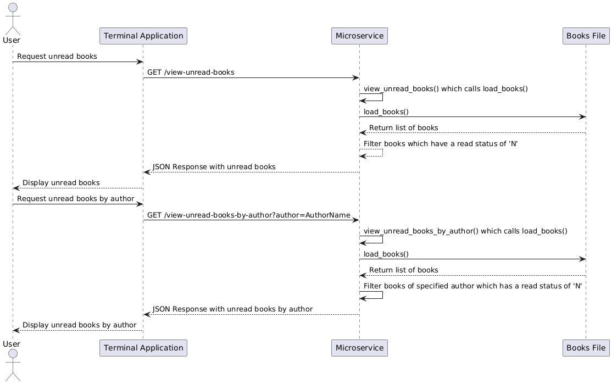

# Unread Books Microservice

## Overview

This microservice provides endpoints to retrieve information about unread books from a JSON file. It supports two main functionalities:

1. **View all unread books**
2. **View unread books by a specific author**

## Communication Contract

### Endpoints

1. **View All Unread Books**
   - **URL:** `/view-unread-books`
   - **Method:** `GET`
   - **Response Format:** JSON array of books with read status 'N'

2. **View Unread Books by Author**
   - **URL:** `/view-unread-books-by-author`
   - **Method:** `GET`
   - **Query Parameters:**
     - `author` (required): The name of the author to filter the unread books by.
   - **Response Format:** JSON array of books with read status 'N' by the specified author

### Example Requests

1. **View All Unread Books**

   **Request:**
   ```bash
      http://127.0.0.1:5000/view-unread-books
   ```

   **Response:**
   ```json
   [
     {
       "title": "1984",
       "author": "George Orwell",
       "read": "N"
     },
     {
       "title": "Moby-Dick",
       "author": "Herman Melville",
       "read": "N"
     },
     ...
   ]
   ```

2. **View Unread Books by Author**

   **Request:**
   ```bash
      http://127.0.0.1:5000/view-unread-books-by-author?author=George%20Orwell
   ```

   **Response:**
   ```json
   [
     {
       "title": "1984",
       "author": "George Orwell",
       "read": "N"
     }
   ]
   ```

## Instructions

### How to Request Data

To request data from the microservice, you can use HTTP GET requests. Here’s how you can do it in Python using the `requests` library:

```python
import requests

# View all unread books
response = requests.get("http://127.0.0.1:5000/view-unread-books")
print(response.json())

# View unread books by author
author = "George Orwell"
response = requests.get(f"http://127.0.0.1:5000/view-unread-books-by-author?author={author}")
print(response.json())
```

### How to Receive Data

The response from the microservice will be in JSON format. To handle this in Python:

```python
import requests

# Example: View all unread books
response = requests.get("http://127.0.0.1:5000/view-unread-books")
if response.status_code == 200:
    unread_books = response.json()
    for book in unread_books:
        print(f"Title: {book['title']}, Author: {book['author']}")
else:
    print("Failed to retrieve data.")

# Example: View unread books by author
author = "George Orwell"
response = requests.get(f"http://127.0.0.1:5000/view-unread-books-by-author?author={author}")
if response.status_code == 200:
    unread_books_by_author = response.json()
    for book in unread_books_by_author:
        print(f"Title: {book['title']}, Author: {book['author']}")
else:
    print("Failed to retrieve data.")
```

## UML Sequence Diagram

 
